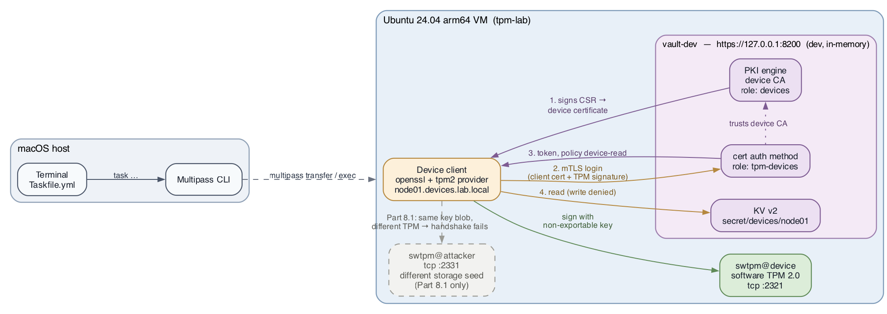
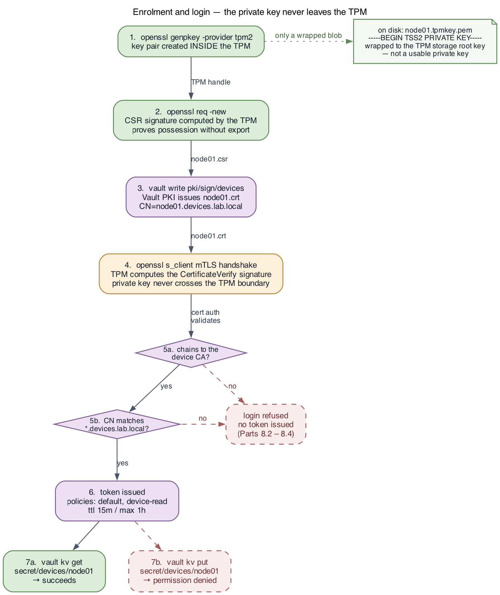

# Architecture

## Overview

Most machine-to-machine authentication rests on something copyable. A Vault token in a
file, an AppRole secret ID, a PEM private key next to its certificate — each is just
bytes. Anyone who can read the file can become the machine, anywhere, for as long as the
credential lives. Rotation shortens the window; it does not close it.

A TPM changes the shape of the problem. A key created inside the TPM never exists
outside it in usable form. What lands on disk is a handle: the key's public area plus a
private area encrypted to that TPM's storage key, an object the TPM can load and use and
that no other TPM can. The credential stops being data you hold and becomes a capability
the hardware grants.

**This lab requires Vault Enterprise.** It uses the `tpm` auth method, which is an
Enterprise feature, running from a private beta build (`vault_2.2.0-beta1+ent`) that is
copied from the host's `.bin/` directory into the VM together with its licence. Nothing
in `.bin/` is ever committed.

The lab demonstrates the whole chain end to end:

- a device identified by its TPM's **endorsement key** (EK), registered with Vault by a
  provisioning orchestrator that holds a narrowly scoped token;
- the device proving, with **no Vault token at all**, that it holds that EK — a
  two-phase EK/AK attestation — and receiving a client certificate from the auth
  method's own internal CA;
- an application key generated inside the TPM, certified by the attestation key, and
  used to sign the mTLS login handshake;
- the tpm auth method validating the certificate and issuing a short-lived,
  least-privilege token;
- negative tests proving that stolen key blobs, an unregistered TPM, a certificate from a
  different CA, a certificate bound to a different TPM and role, and a revoked token all
  fail.

The TPM is a software TPM (`swtpm`) rather than silicon, because macOS does not expose a
TPM to Multipass guests. Everything above the device path is identical to real hardware.

## Topology



| Component | What it is | Why it lives where it does |
|---|---|---|
| Terminal / `Taskfile.yml` | The only thing on the macOS host, plus `.bin/` | The host holds source and the private beta binary, never lab state |
| Multipass CLI | Creates the VM; `multipass transfer` + `exec` push scripts (and, once, the Vault binary) in | The lab needs Linux, systemd and a TPM stack |
| `swtpm@device` | Software TPM 2.0, systemd unit, serving `~/lab/tpmstate/device/swtpm.sock` | macOS exposes no TPM to guests, so the VM provides its own |
| `swtpm@attacker` | A second software TPM with a **different storage seed**, and therefore a different EK | Stands in for "a different machine" during the Part 8 tests. Used by those tests only |
| Device client | The Vault CLI: `vault tpm ek`, `vault tpm attest`, `vault login -method=tpm` | Reads the EK, runs the attestation, drives the mTLS login — all against the TPM socket |
| `vault-dev` (https://127.0.0.1:8200) | `vault server -dev -dev-tls`, Vault Enterprise, systemd unit | Dev mode keeps the lab to one command; TLS is required for a client-certificate login |
| `identity/tpm` | Vault's registry of endorsement keys, and the `devices` TPM group | Which silicon the operator has decided to trust |
| tpm auth method | Mount `auth/tpm`: an internal CA, and the role `devices` bound to the group | Verifies the attestation, issues the certificate, validates it at login, issues the token |
| KV v2 secret | `secret/devices/node01` | The thing the device is actually trying to read |

Two constraints explain the layout:

- **macOS does not expose a TPM to Multipass guests.** `swtpm` provides one inside the
  VM, on a unix socket. On real hardware the only change is pointing at
  `/dev/tpmrm0` instead of `~/lab/tpmstate/device/swtpm.sock` — nothing above that line
  changes.
- **Vault's dev TLS certificate is issued for `127.0.0.1` only.** Putting the client and
  the server side by side in the same VM keeps the server-side TLS trust trivial, so the
  demo stays focused on the *client* certificate.

## Enrolment and login flow



The trust chain, step by step:

1. **The endorsement key.** `vault tpm ek` reads the EK public key from the TPM and
   prints it with its TPM ID. The EK is derived from a seed burned into the TPM at
   manufacture; its private half never leaves the chip. The TPM ID is nothing more than
   the SHA-256 of the EK public key's DER encoding — `task enrol` recomputes it locally
   with `openssl` to show there is no hidden registry value.
2. **The orchestrator registers the device.** Holding an `enrol-orchestrator` token —
   *not* the root token — it writes the EK to `identity/tpm` as `node01`, then adds the
   resulting TPM ID to the `devices` TPM group. That is its entire privilege: `update` on
   `identity/tpm` and `read`/`update` on `identity/tpmgroup/name/devices`. It cannot
   read the auth role, let alone change it, and it cannot read a secret.

   The group is the indirection that keeps this least-privilege. The auth role trusts
   the group, so admitting a device means editing group membership, which the
   orchestrator may do, rather than editing the role, which it may not — a role write
   could also change `token_policies`, and that is an escalation path, not an enrolment.
3. **The device begins attestation — with no token.** `vault tpm attest` creates a fresh
   attestation key (AK) in the TPM and calls `auth/tpm/role/devices/gentpmcert/begin`
   with the EK public key and the AK's parameters. Vault looks the EK up in
   `identity/tpm`, checks that the role trusts it (directly or through a group), and
   returns a challenge: a secret encrypted so that only that EK can decrypt it, bound to
   the AK's name.
4. **The TPM answers the challenge.** `TPM2_ActivateCredential` decrypts the secret. The
   TPM will only do so if the AK really lives in the same TPM as the EK — which is what
   binds the freshly created AK to the manufactured identity.
5. **The device finishes attestation.** It generates the application key in the TPM, has
   the AK certify that the key was created there with the attributes it claims, builds a
   CSR for it, and calls `gentpmcert/finish` with the decrypted secret, the CSR and the
   certification.
6. **Vault's internal CA issues the certificate.** The mount's own CA — created when the
   method was enabled and rotated automatically — signs a client certificate whose
   Subject Alternative Name carries two OtherNames: the TPM ID and the role name. Those
   two are the identity. The common name, `node01.devices.lab.local`, is whatever the
   device passed as `-cert-subject-CN`; Vault records it but never checks it. The certificate, the CA chain and the two key handles
   (`app.blob`, `ak.blob`) land in the device's state directory.
7. **mTLS login.** `vault login -method=tpm` opens a TLS connection presenting that
   certificate and asks the TPM to compute the handshake signature with the application
   key. The request goes to `auth/tpm/login`.
8. **Vault validates.** The certificate must be signed by *this mount's* internal CA, and
   the TPM ID in its SAN must be one the requested role trusts. Either check failing
   means no token.
9. **A scoped token comes back.** Policies `default` and `device-read`, a 15-minute TTL,
   a one-hour maximum, and metadata naming the TPM ID, the role and the common name.
10. **The device uses it.** It reads `secret/devices/node01` successfully; a write to the
    same path is denied.

Steps 1–6 happen **once per device, ever** — or once per certificate lifetime, since
`task enrol` re-attests only when the certificate is within an hour of expiry. Every
login after enrolment is step 7 onwards: the TPM key and the certificate are the
credential, and there is no bootstrap secret on the device to leave behind, because there
never was one.

## Trust model

| Party | What it actually trusts / guarantees |
|---|---|
| Vault tpm auth | Its **own internal CA**, and the **TPM group** bound to the role. A certificate it issued, for a TPM ID the role trusts, is a valid device |
| `identity/tpm` | Whoever holds a token permitted to write it — the `enrol-orchestrator` policy, so "whoever can register a device" is a named, auditable identity rather than root |
| The attestation | That the AK and the application key were created inside the TPM that holds the registered EK. This is cryptographic evidence of TPM residency, not an assertion by whoever provisioned the device |
| The TPM | That the private keys cannot be extracted (`fixedtpm`, `fixedparent`), and that every signature was produced by that specific TPM |
| The certificate | Binds a TPM ID and a role to a public key. Because it was issued only after attestation, it *does* say where the key lives. The common name is **self-asserted** by the device and enforced by nothing — do not template policy on it; use the TPM ID |

What the TPM does **not** give you:

- **It binds the key to the machine, not to a user or a process.** Anyone with
  sufficient privilege on the running device — root, or any account permitted to talk to
  `/dev/tpmrm0` — can ask the TPM to sign. The key cannot be stolen and used elsewhere;
  it can absolutely be *used* in place by a local attacker.
- **It does not gate on boot state by default.** A key can be bound to PCR values so it
  is only usable when the measured boot chain matches; the Vault CLI's key template does
  not do that, and this lab does not either.
- **It does not revoke anything.** Certificate lifetime, disabling a TPM record and token
  TTLs remain Vault's job — and see the observations below on what `disabled` does and
  does not do in this beta.

The honest summary: a TPM converts a copyable secret into a machine-bound one, and
attestation lets Vault verify that conversion happened rather than take it on trust.
That defeats credential exfiltration, which is the common case. It does not defeat an
attacker who already owns the running machine.

### Bootstrapping the first certificate

Everything above assumes the device already has a certificate. Getting the *first* one is
usually the hard part, because at that moment the device has no identity Vault
recognises — and the traditional answers (a wrapped AppRole SecretID, a token baked into
an image) all amount to delivering a secret to the device somehow.

The tpm auth method dissolves the problem rather than solving it. The device *does* have
an identity Vault can recognise before it holds any credential: its endorsement key. The
attestation endpoints are unauthenticated by design — confirmed empirically: a call with
no token, or with a bogus token, gets a `400` for a malformed request rather than a
`403` — because possession of a registered EK is the credential. Nothing is delivered to
the device. What travels is the EK *public* key, from the device to the orchestrator,
and it is public.

| Previous design (cert auth + PKI) | This design (tpm auth) |
|---|---|
| A response-wrapped, one-shot AppRole SecretID delivered to the device | Nothing delivered. The device proves possession of an EK Vault already knows |
| A `device-enrol` token on the device, briefly, with `update` on `pki/sign/devices` | No token on the device, ever. `VAULT_TOKEN` is set to a placeholder during enrolment so the transcript proves it |
| Trust-by-delivery: Vault signed the CSR because the caller held a valid SecretID | Trust-by-hardware: Vault issues because the TPM answered a challenge only the registered EK could decrypt |
| Secure introduction was the acknowledged weak link | Secure introduction is replaced by EK registration, which happens out of band and needs no secrecy |
| The orchestrator could mint enrolment credentials for any device | The orchestrator can register EKs and admit them to one group, and nothing else |

The residual trust is in the registry: whoever can write `identity/tpm` and the group
decides which silicon counts. That is the orchestrator, and its policy is two paths.
Compromising it yields the ability to enrol attacker-controlled TPMs, which is bad, but
not the ability to read a secret, change what the role grants, or mint a token.

### Operator, orchestrator and device

The split is the teaching point, so it is worth naming which side holds what. There are
three privilege domains:

| | Operator | Orchestrator / provisioning system | Device |
|---|---|---|---|
| Token held | Root | `enrol-orchestrator`, minted by the operator, 24h | **None** |
| Privilege | Configure trust: the mount, its CA, the group, the role, the policies | `update` on `identity/tpm`, `read`+`update` on `identity/tpmgroup/name/devices` — can register a TPM and admit it, and nothing else | Attest (unauthenticated) and log in (unauthenticated). Everything it can do, it can do because of what its TPM holds |
| When | Once, at lab build (`task config`) | Once per device, at provisioning time (`task enrol`, 6.2) | Once per device for attestation (`task enrol`, 6.3); every login thereafter |

Be honest about the recursion: root created the orchestrator's token, so root remains
the ultimate authority in this lab. The claim is not that root vanished — it is that
root is not on the wire when a device enrols, that the privilege that *is* present there
is bounded and named, and that the device side carries no privilege at all.

`task config` still runs as root. That is correct. It is the operator establishing trust
— enabling the auth method, configuring its CA, creating the group, the role, the
policies, and the orchestrator's own credential. Handing out privilege is the operator's
job; exercising it is not.

## What each part proves

| Lab part | Task | What to conclude |
|---|---|---|
| 1–3 | `task provision`, `task tpm`, `task vault` | The environment is reproducible: the Vault Enterprise binary is installed from `.bin/`, and the TPMs and Vault come up as managed systemd units |
| 4–5 | `task config` | Trust is configured explicitly — the tpm auth mount and its CA, the `devices` group and role, the `device-read` and `enrol-orchestrator` policies, and the orchestrator's token. The one step that legitimately uses the root token |
| 6 | `task enrol` | The device's identity is its EK. The orchestrator registers it with a scoped token; the device attests with no token at all, and the certificate it receives names its TPM |
| 6.4 | `task demo:nonexportable` | The files on disk are TPM handles: `KeyBlob` is ciphertext, `openssl` cannot load them, the public area carries `fixedtpm` and `fixedparent`, and the public key matches the certificate |
| 7 | `task demo:login` | A TPM-held key authenticates to Vault over mTLS and returns a real token, whose metadata names the TPM |
| 7.3 | `task demo:privilege` | The token is least-privilege: the read succeeds, the write is denied |
| 8.1 | `task demo:negative:stolen-key` | Copying the state directory is worthless — a different TPM fails the blob's integrity check, so the handshake never starts |
| 8.2 | `task demo:negative:unenrolled-tpm` | An EK Vault has not registered is refused at `gentpmcert/begin`: attestation is open to anyone, and useful only to registered silicon |
| 8.3 | `task demo:negative:untrusted-ca` | A genuinely attested certificate from a *different* tpm auth mount is rejected; each mount trusts only its own CA |
| 8.4 | `task demo:negative:wrong-role` | A genuine certificate from the trusted CA, for a TPM the `devices` role does not trust, is rejected; the same certificate is accepted by its own role |
| 8.5 | `task demo:negative:revoked-token` | Hardware binding does not outlive revocation; a revoked token is dead immediately |

`task demo` runs all of the above in order.

### The commands

Every Vault command below is printed by the scripts as they run, from the same argv
they execute — there is no separate copy to drift. Bearer tokens are redacted on the
way to the screen; the device's deliberate `VAULT_TOKEN=device-holds-no-token`
placeholder is not, because showing it is the point.

**Parts 4–5, as the operator** (`task config`, the one step that uses the root token):

```bash
vault auth enable -path=tpm tpm
vault write auth/tpm/config default_cert_ttl=24h

vault kv put secret/devices/node01 message='hello from vault, attested by TPM key'

vault policy write device-read - <<'EOF'
path "secret/data/devices/*" {
  capabilities = ["read"]
}
EOF

vault write identity/tpmgroup name=devices metadata=domain=devices.lab.local
group_id="$(vault read -field=id identity/tpmgroup/name/devices)"

# The role trusts the group, never individual TPM IDs — see Trust model above.
vault write auth/tpm/role/devices \
  tpmgroup_ids="${group_id}" \
  display_name=tpm-devices \
  token_policies=device-read \
  token_ttl=15m \
  token_max_ttl=1h

vault policy write enrol-orchestrator - <<'EOF'
path "identity/tpm" {
  capabilities = ["update"]
}
path "identity/tpmgroup/name/devices" {
  capabilities = ["read", "update"]
}
EOF

vault token create -policy=enrol-orchestrator -no-default-policy -ttl=24h \
  -display-name=enrol-orchestrator
```

**Part 6, as the device — no token** (`task enrol`, steps 1 and 3):

```bash
vault tpm ek -tpm-device-path="${TPM_SOCK}" -format=json

vault tpm attest \
  -role-name=devices \
  -mount-path=auth/tpm \
  -tpm-device-path="${TPM_SOCK}" \
  -tpm-state-dir=~/lab/tpm/node01 \
  -cert-subject-CN=node01.devices.lab.local
```

**Part 6.2, as the orchestrator — scoped token, not root:**

```bash
vault write identity/tpm name=node01 tpm_ek_public_key=@ek.pub \
  metadata=domain=devices.lab.local

# A group write replaces the member list, so it is read-modify-write.
vault read -format=json identity/tpmgroup/name/devices
vault write identity/tpmgroup/name/devices member_tpm_ids="${existing},${tpm_id}"
```

**Part 7, as the device — no token:**

```bash
vault login -method=tpm -no-store -format=json \
  role_name=devices \
  tpm-state-dir=~/lab/tpm/node01 \
  tpmDevice="${TPM_SOCK}"
```

`-no-store` keeps the device token out of `~/.vault-token`, where it would otherwise
replace the dev root token the lab shell relies on.

> **On the rejection messages.** 8.2 is specific: `no TPM found for EK public key`.
> 8.3 and 8.4 both return `authentication failed` from `auth/tpm/login` — Vault does not
> say whether the chain or the role binding failed, so the two cases are distinguished
> by what you changed, not by the error text. 8.1 never reaches Vault at all: the message
> is the TPM's, `Load() failed: … integrity check failed`. Worth saying out loud when
> presenting.

### Observations from building this

Everything below was established by running the private beta on Ubuntu 24.04 arm64,
not by reading documentation. Several of these shaped the scripts.

| Expectation | Reality |
|---|---|
| Attestation needs a Vault token, so a bootstrap credential is still required | **It does not.** `gentpmcert/begin` and `finish` are unauthenticated: no token or a bogus token both get a `400` for a malformed body, never a `403`. The `403 permission denied` seen early on came from the backend, for an EK that was registered but not trusted by the role — a different thing. The device side of enrolment therefore holds no credential, and the AppRole bootstrap from the cert-auth design was removed |
| The Vault CLI needs a real `/dev/tpm*` device | It accepts a unix socket in `-tpm-device-path`, and swtpm can serve one (`--server type=unixio`). tpm2-tools reach the same socket via `TPM2TOOLS_TCTI=swtpm:path=…`, which also needs the `.ctrl` socket beside it. One socket per TPM serves everything; the earlier TCP ports are gone. The `device:` TCTI cannot open a socket, so the swtpm TCTI is the one to use |
| A raw socket behaves like `/dev/tpmrm0` | It does not. `/dev/tpmrm0` is a kernel resource manager that frees transient objects when a client disconnects. Over a raw socket nothing does, and `vault login -method=tpm` leaves one loaded key behind per call. swtpm has three transient slots, so the fourth login fails with `out of memory for object contexts`. `vault tpm attest` cleans up after itself. The scripts run `tpm2_flushcontext -t` before every TPM-touching Vault call (`flush_tpm_contexts` in `common.sh`); on real hardware the resource manager makes this unnecessary |
| Re-attesting is harmless | Vault rate-limits attestation per EK: a second `begin` within roughly ten seconds returns `rate limit exceeded for this EK`. `task enrol` therefore keeps a certificate that is still good for an hour, and every script that attests retries after a 12-second wait |
| `vault login` is side-effect free | Without `-no-store` it writes the new token to `~/.vault-token`, replacing the dev root token the lab shell relies on. Every login in the lab passes `-no-store` |
| Disabling a TPM record cuts the device off | Setting `disabled=true` on `identity/tpm/name/node01` blocked **neither** a fresh attestation **nor** a login in this beta. Revocation therefore means removing the TPM from the group, deleting the record, or revoking tokens — not the `disabled` flag. Retest on a release build |
| Enabling a second mount is enough to attest against it | The mount refuses attestation until `auth/<mount>/config` has been written at least once (`TPM auth backend not configured`), even though every field has a default. 8.3 writes the config explicitly |
| The key blobs are TSS2 PEM files | They are JSON handles (go-attestation's serialisation): `Public`, `KeyBlob`, `Name`, and the AK's `CreateAttestation`/`CreateSignature`. `Public` is a bare `TPMT_PUBLIC`, so `tpm2_print -t TPM2B_PUBLIC` needs a two-byte length prefix first; with it, the application key shows `fixedtpm|fixedparent|sensitivedataorigin|userwithauth|sign`. `KeyBlob` is 126 bytes of ciphertext. `client-key.json`'s `public_key_sha256` equals the SHA-256 of the certificate's SubjectPublicKeyInfo |
| Group membership is additive | A write to `identity/tpmgroup/name/<group>` with `member_tpm_ids` **replaces** the list. The orchestrator does a read-modify-write |
| The certificate's common name is a checked identity | It is not. `vault tpm attest -cert-subject-CN=…` puts whatever the device says into the subject, and `auth/tpm/login` checks only the CA and the TPM ID against the role. A second TPM in the `devices` group could attest as `node01.devices.lab.local`. The cert-auth design enforced names through `allowed_common_names`; here the TPM ID is the identity and the CN is a label |
| A cached certificate survives `task config` | `task config` re-enables the mount after a Vault restart, which creates a new internal CA, so a certificate on disk from the old CA looks valid and fails at login. `30_vault_config.sh` deletes `client.crt`/`ca_chain.pem` under `~/lab/tpm/*/` whenever it enables a fresh mount, so `task config && task enrol` re-attests |
| The TPM ID is an opaque registry key | It is `sha256-` plus the SHA-256 of the EK public key's DER. `task enrol` recomputes it with `openssl` and they match |
| The lab is still Vault-edition-agnostic | It is not. `vault auth enable tpm` is Enterprise only, and `task config` refuses to run against a binary whose version string lacks `+ent` |
| The TPM package name is stable | It is release-specific. On 24.04 it is `libtss2-tcti-swtpm0t64` — the `t64` transition. `task provision` resolves it dynamically |
| A permission error on the TPM state dir is a file-ownership problem | It is AppArmor. The directory can be owned correctly and still be denied; keeping state under `~/lab` satisfies the shipped profile |

One thing was *not* tested: whether the Enterprise dev server starts without a licence.
The licence was always present (`VAULT_LICENSE_PATH` in the unit; `sys/license/status`
reports it autoloaded), so the lab treats it as required.

## Lab layout inside the VM

All lab state lives inside the VM, owned by the `ubuntu` user, under `~/lab`:

| Path | Contents |
|---|---|
| `~/lab/env.sh` | The TPM and Vault environment (`TPM_DEVICE_PATH`, `TPM2TOOLS_TCTI`, `ATTACKER_TPM_DEVICE_PATH`, `VAULT_ADDR`, `VAULT_CACERT`, `VAULT_TOKEN`). Every scripted command sources this, so an interactive `task shell` session sees exactly the same environment |
| `~/lab/vault.hclic` | The Enterprise licence, 0600, read by the dev server via `VAULT_LICENSE_PATH` |
| `~/lab/state/` | Lab state: `config.json` (the Parts 4-5 sentinel), `orchestrator.token` (0600 — the scoped credential `task enrol` uses to register the device) and `login.json` (0600 — the last device token) |
| `~/lab/tpmstate/<instance>/` | Software TPM state and its socket, one directory per swtpm instance. The storage seed lives here — this is what makes the key handles machine-bound |
| `~/lab/vault-tls/` | The dev server's own TLS material: `vault-ca.pem`, `vault-cert.pem`, `vault-key.pem` |
| `~/lab/tpm/<device>/` | What `vault tpm attest` wrote: `client.crt`, `ca_chain.pem`, `app.blob`, `ak.blob`, `client-key.json`, plus `ek.pub` and `tpm_id` from step 6.1. The Part 8 tests keep their own directories beside it (`stolen`, `attacker`, `rogue`) |

Three systemd units run the daemons:

| Unit | Role |
|---|---|
| `swtpm@device` | The device's software TPM on `~/lab/tpmstate/device/swtpm.sock` |
| `swtpm@attacker` | A second, independently seeded TPM on `~/lab/tpmstate/attacker/swtpm.sock`, used only by the Part 8 tests |
| `vault-dev` | `/usr/local/bin/vault server -dev -dev-tls` on https://127.0.0.1:8200 |

Running them as units rather than `nohup` plus PID files is a deliberate departure:
readiness becomes `systemctl is-active` instead of a blind `sleep`, restarts are ordinary
`systemctl restart`, and logs come from `journalctl` rather than files nobody rotates.
The attacker TPM gets its own socket rather than displacing the device TPM, so the
stolen-key test never requires stopping and restarting the real one.

## Running it

| Task | What happens | What to expect |
|---|---|---|
| `task deps` | Checks host tooling and that the Vault binary and licence are in `.bin/` | Required tools listed as ok; warnings for anything missing |
| `task init` | Installs pre-commit hooks, seeds `.env` from the template | One-time, host only. `.env` can override `VM_NAME`, `DEVICE_NAME`, `DOMAIN`, `VAULT_BIN` and `VAULT_LICENSE` |
| `task launch` | Creates the Multipass VM | No-op if `tpm-lab` already exists |
| `task provision` | Pushes the Vault Enterprise binary and licence into the VM (skipped when the installed copy already matches), installs swtpm and tpm2-tools, removes any apt-installed Vault | Slowest step on first run; near-instant afterwards |
| `task tpm` | Installs and starts both swtpm units on their sockets | Both units active; each TPM answers `tpm2_getrandom`, and its EK ID is printed |
| `task vault` | Starts the Vault dev server unit with the licence | `vault status` shows `Sealed false`, `Version 2.2.0-beta1+ent` |
| `task config` | Enables tpm auth and configures its CA (clearing any certificates from a previous CA), writes the KV secret and the `device-read` policy, creates the `devices` group and role, writes the `enrol-orchestrator` policy and mints its token | Re-runnable; this is the step to repeat after a Vault restart. Uses the root token, correctly |
| `task enrol` | Reads the EK, registers it and admits it to the group as the orchestrator, attests as the device with no token, verifies the certificate's SAN | A certificate naming the TPM ID and role; re-runs skip attestation while the certificate is fresh |
| `task all` | All of the above in order | Ends with "Lab ready" |
| `task demo:nonexportable` | Shows the blob structure, the failed `openssl` load, the `fixedtpm` attributes and the matching public key | The talking point that lands hardest |
| `task demo:login` | The mTLS login | A client token with policies `default` and `device-read`, and metadata naming the TPM |
| `task demo:privilege` | Read then write with the device token | Read succeeds, write is denied |
| `task demo:negative` | All five negative tests in order | Each prints its expected and actual outcome for the operator to judge |
| `task demo` | The complete narrated run | Pauses between parts; about a minute with `PAUSE=0` |
| `task shell` | Interactive shell in the VM | `source ~/lab/env.sh` to work by hand |
| `task logs`, `task logs:tpm`, `task logs:vault` | Journals for the lab units | |
| `task reset` | Clears lab state and both TPMs' seeds, keeps the VM, the binary and the licence | Rebuild with `task tpm vault config enrol` |
| `task clean` / `task rebuild` | Destroy the VM / destroy and rebuild | |
| `task lint` | pre-commit: shellcheck, gitleaks | Must pass before committing |
| `task docs:diagram` | Re-renders both PNGs from the `.dot` sources | Needs graphviz on the host |

### Pacing the demo

`task demo` stops between each part and waits, so there is room to talk over what just
happened before the next thing scrolls past:

```
────────────────────────────────────────────────────────────
next: Part 8 — the five negative tests
  ⏎ continue · q quit
```

`q` stops the run and prints the task to resume with, so a session can be picked up
where it was left. `PAUSE=0 task demo` restores the uninterrupted run, and `PAUSE=0` in
`.env` makes that permanent. The prompt is host-side (`scripts/host/pause.sh`) and reads
`/dev/tty` directly: with no terminal — a pipe, CI — it is skipped rather than blocking.

Pauses sit between the demo tasks, not inside them. Running one part on its own
(`task demo:login`) never prompts.

## Troubleshooting

| Symptom | Likely cause | Fix |
|---|---|---|
| `task provision` stops at a precondition about `.bin/` | The private beta binary or the licence is not on the host | Copy `vault_2.2.0-beta1+ent_linux_arm64` and `vault.hclic` into `.bin/`, or point `VAULT_BIN` / `VAULT_LICENSE` at them in `.env` |
| `vault-dev` will not start | Port 8200 already held, the TLS directory is unwritable, or the licence file in the VM is bad | `journalctl -u vault-dev -n 50` |
| `authentication failed` at login right after `task config`, with a certificate that looks valid | The certificate was issued by the mount's previous CA | `task enrol` — `task config` has already cleared the stale certificate, so enrol re-attests |
| `task config` dies with "not an Enterprise build" | An OSS `vault` is first on `PATH` | Re-run `task provision`, which removes the apt package and installs to `/usr/local/bin` |
| `tpm2_getrandom` hangs or errors | The device TPM is not running, or the TCTI variables are not set | `systemctl is-active swtpm@device`; `journalctl -u swtpm@device -n 50`; in an interactive shell, `source ~/lab/env.sh` |
| `swtpm@device` fails with `Could not open lockfile: Permission denied` | AppArmor, not file ownership. Ubuntu's `usr.bin.swtpm` profile allows state only under `owner @{HOME}/**` and `owner /var/lib/swtpm/**` | The lab keeps state in `~/lab/tpmstate`, which the profile already permits. If you move `TPM_STATE_ROOT` elsewhere, expect this. Confirm with `sudo dmesg \| grep -i apparmor` |
| `Failed to connect to …/swtpm.sock.ctrl` from tpm2-tools | The swtpm TCTI needs the control socket beside the data socket | Both are created by the unit; check `ls ~/lab/tpmstate/device/` and restart `swtpm@device` |
| `out of memory for object contexts` from a login or attest | Transient handles leaked by earlier logins — there is no resource manager over a raw socket | `tpm2_flushcontext -t` (the scripts do this for you); see the observations above |
| `rate limit exceeded for this EK` | A second attestation within ~10s of the last | Wait and retry; `task enrol` and the Part 8 scripts already do |
| `no TPM found for EK public key` at attestation | The EK is not in `identity/tpm` | Run `task enrol` (or, after a Vault restart, `task config && task enrol`) |
| `permission denied` (403) at `gentpmcert/begin` | The EK is registered but the role does not trust it — not in the group, or the role names another group | `vault read auth/tpm/role/devices`; `vault read identity/tpmgroup/name/devices` |
| `authentication failed` at login | The certificate was issued by another mount's CA, or names a TPM the role does not trust | Compare the certificate's SAN (`openssl x509 -ext subjectAltName`) with the role and group |
| Every `vault` command as `ubuntu` suddenly acts as the device | `~/.vault-token` was overwritten by a login run without `-no-store` | `printf root > ~/.vault-token` (env.sh's `VAULT_TOKEN=root` normally shadows the file anyway) |
| Every Vault path 404s or permission-denies at once | The Vault dev server restarted and its in-memory state is gone | `task config && task enrol` |
| The stolen-key test appears to *succeed* | The client is still pointed at the device TPM | Check which socket the test used; both `swtpm@device` and `swtpm@attacker` should be active |
| Multipass commands hang on the host | The VM is stopped or suspended | `multipass info tpm-lab`; `task start` |

Because Vault dev mode is entirely in-memory, "all the configuration vanished" is the
single most common failure, and `task config && task enrol` is always the answer. Nothing
needs rebuilding from scratch for that.

## From lab to production

| Lab | Production |
|---|---|
| `swtpm` on a unix socket, with `tpm2_flushcontext` before each call | Hardware or firmware TPM via `/dev/tpmrm0` — the kernel resource manager makes the flushing unnecessary, and nothing else changes |
| A private beta binary copied from `.bin/` | A released Vault Enterprise build from the usual channel |
| `vault server -dev -dev-tls` | HA cluster with Raft storage, a real server certificate, and auto-unseal |
| One tpm auth mount with its internal CA and one role | Per-fleet roles bound to per-fleet TPM groups, each with its own policies and token bounds; `token_bound_cidrs` where the network allows |
| Root token for operator work — `task config` only. Registration uses the scoped `enrol-orchestrator` token, and the device never holds any | Scoped admin policies throughout; the root token generated only for break-glass and revoked afterwards |
| The orchestrator's token written to a file on the same box, minted fresh on every `task config` | The provisioning system authenticates as its own workload identity, with short-lived credentials it renews rather than a token at rest |
| EK public keys read from the live TPM and registered one at a time | EK public keys (or EK certificates) collected from the manufacturer or at imaging time and pre-registered with `vault tpm enroll -ekpem=…`, before the device ever boots |
| 24-hour certificates, refreshed by re-running `task enrol` | `vault tpm reattest` on a schedule, well inside the certificate lifetime |
| A single KV secret | Per-device paths templated on the token's `tpm_id` metadata or entity alias, so devices cannot read each other's secrets |
| No boot-state gating | Keys sealed to PCR policy, so a tampered boot chain loses access |
| Audit device optional | Audit devices mandatory, shipped off-host, with per-device entity aliases for attribution |

## Stretch goals not automated

Extensions that are documented but deliberately not scripted, because each one needs
judgement or code rather than another idempotent step:

- **Revocation before expiry.** Remove a TPM ID from the `devices` group, or delete its
  `identity/tpm` record, and watch the next login fail while the certificate is still
  valid. Then restore it. Worth demonstrating live — and worth re-testing the `disabled`
  flag on each new build, since in this beta it changed nothing.
- **Identity and audit inspection.** Enable a file audit device, log in, and follow the
  token to its entity. Each TPM produces its own entity alias, which is what gives
  per-device attribution in the audit log.
- **Renewal.** Run `vault tpm reattest` against a state directory whose certificate is
  near expiry and show that the subject and role come from the existing certificate.
- **PCR binding.** Bind key use to measured boot state so that "this machine" becomes
  "this machine, booted the way we expect". The Vault CLI creates the application key
  with its own template, so this needs either an upstream option or a custom client.
- **A production-style client.** The Vault CLI already does what the old
  `openssl s_client` scaffolding did, so the remaining gap is an agent: something that
  runs `vault login -method=tpm` on a schedule, renews the token, and re-attests before
  the certificate expires.
